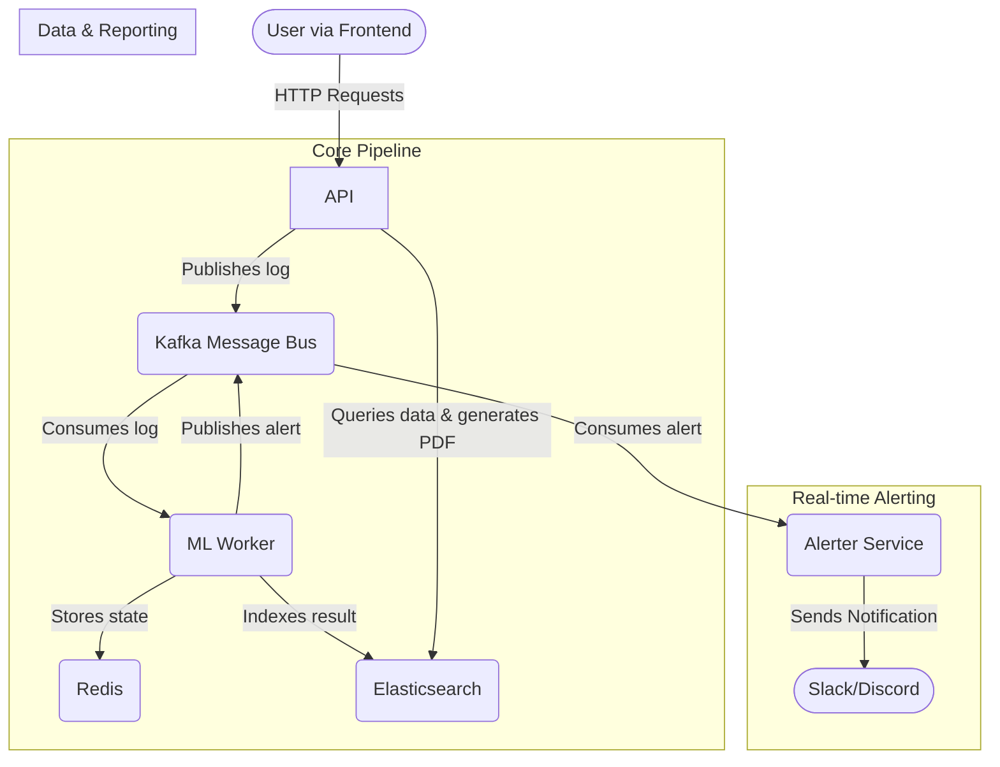

# AI/ML-Powered SOC Dashboard

This project is a real-time Security Operations Center (SOC) dashboard that uses a rule-based model to detect anomalies in log data. It's built with a modern microservices architecture using Python (FastAPI), Kafka, Elasticsearch, Redis, and a plain HTML/JS frontend.

The system ingests log messages, analyzes them for threats like brute-force attacks or suspicious keywords, and displays them on a live dashboard. It also features dynamic IP whitelist management to reduce false positives.

## Key Features

- **Real-Time Log Processing**: Ingests and analyzes logs with low latency using a Kafka-based event-driven pipeline.
- **Multi-Layered Anomaly Detection**: Identifies suspicious logs based on keywords, traffic spikes, and other patterns.
- **Brute-Force Attack Detection**: Uses Redis to track failed login attempts from specific IPs within a time window.
- **Dynamic IP Whitelisting**: Allows SOC analysts to add or remove IPs from a whitelist in real-time without service restarts.
- **IP Blocklist Management**: Immediately block suspicious IPs via the UI, preventing them from accessing the API. The API also includes a middleware to block requests from these IPs.
- **Web-Based UI**: A clean, responsive, dark-themed dashboard to view real-time alerts and successful logs. Features include:
    -   **System Status**: A "traffic light" indicator (ALL GOOD / INCIDENT) and key metrics (attempts blocked, recent incidents, uptime).
    -   **Alert & Log Display**: Clearly distinguishes between failed attempts (alerts) and successful attempts (logs) with color-coding.
    -   **Interactive Alert Management**: Buttons to resolve individual alerts, re-open resolved alerts, and a "Resolve All" button for bulk actions.
    -   **IP Management**: Dedicated sections for adding/removing IPs from whitelist and blocklist.
    -   **Notification Settings**: Configure Slack or Discord webhooks directly from the UI.
- **Real-time Notifications**: Pushes high-priority alerts to Slack or Discord via webhooks.
- **On-Demand PDF Reports**: Download a detailed PDF incident report, including charts for top incident reasons and top attacked IPs, directly from the dashboard.
- **Microservices Architecture**: Each component is a separate service (API, ML Worker, Frontend) containerized with Docker for scalability and maintainability.

## Project Architecture

The application is composed of several services that work together to process and display log data:



1.  **Frontend (`:3000`)**: A simple HTML/JS dashboard that displays alerts and successful logs. It polls the API for new data and allows users to manage the IP whitelist.
2.  **API Server (`:8000`)**: A FastAPI backend that serves as the main entry point. It receives new logs, publishes them to Kafka, and provides endpoints for the frontend to fetch processed data from Elasticsearch and manage the IP whitelist.
3.  **Kafka (`:9092`)**: A message broker that decouples the API from the ML worker. The API produces messages to the `logs` and `config-updates` topics.
4.  **ML Worker**: A Python service that consumes messages from the `logs` and `config-updates` topics. It uses a rule-based model (with Redis for stateful checks like brute-force detection) to analyze logs, enriches the data, and indexes the results into Elasticsearch. It dynamically updates its IP whitelist from the `config-updates` topic.
5.  **Redis (`:6379`)**: An in-memory data store used by the ML Worker for high-speed operations, specifically for tracking failed login counts for brute-force detection.
6.  **Elasticsearch (`:9200`)**: A search and analytics engine used to store the processed and enriched log data. It serves as the database for our alerts and logs.
7.  **Kibana (`:5601`)**: A visualization tool for Elasticsearch, useful for debugging and exploring the indexed data directly.

### Data Flow

1.  **Log Submission**:
    `User/Client` -> `API (/logs)` -> `Kafka (logs topic)` -> `ML Worker` -> `Elasticsearch`

2.  **Data Display**:
    `Frontend` -> `API (/alerts)` -> `Elasticsearch` -> `Frontend`

3.  **Whitelist Update**:
    `Frontend` -> `API (/whitelist)` -> `Kafka (config-updates topic)` -> `ML Worker`

## Getting Started

### Prerequisites
- Docker
- Docker Compose

### Running the Application

1.  Clone the repository.
2.  Navigate to the project's root directory.
3.  Run the following command to build and start all the services:

    ```bash
    docker-compose up --build
    ```

4.  Once all services are running, you can access:
    -   **SOC Dashboard**: http://localhost:3000
    -   **API Docs**: http://localhost:8000/docs
    -   **Kibana**: http://localhost:5601

## How to Test with cURL

You can interact with the API directly using `curl` to test its functionality.

#### Submit a Log

Send a log message to the API. The ML worker will process it.

*   **Submit an anomalous log (contains a keyword like "failed"):**
```bash
curl -X POST "http://localhost:8000/logs" -H "Content-Type: application/json" -d '{"message": "failed login attempt for user admin from 192.168.1.105"}'
```

**Submit a normal log:**
```bash
curl -X POST "http://localhost:8000/logs" -H "Content-Type: application/json" -d '{"message": "user guest successfully accessed resource /index.html from 10.0.0.5"}'
```

### 2. View Alerts and Logs

**Get alerts (anomalies):**
```bash
curl "http://localhost:8000/alerts?is_anomaly=true"
```

**Get successful logs (non-anomalies):**
```bash
curl "http://localhost:8000/alerts?is_anomaly=false"
```

### 3. Update an Alert's Status

First, get an alert ID from the `GET /alerts` command above. Then, use that ID to update its status.

```bash
# Replace {your_alert_id} with an actual ID from the previous command
curl -X PATCH "http://localhost:8000/alerts/{your_alert_id}" -H "Content-Type: application/json" -d '{"status": "resolved"}'
```

### 4. Manage the IP Whitelist

**Get the current whitelist:**
```bash
curl "http://localhost:8000/whitelist"
```

**Add a new IP to the whitelist:**
```bash
curl -X POST "http://localhost:8000/whitelist" -H "Content-Type: application/json" -d '{"ip": "8.8.8.8"}'
```

After adding this IP, try submitting a log with the keyword "failed" from `8.8.8.8`. The ML worker will see that the IP is whitelisted and will not flag it as an anomaly.

```bash
curl -X POST "http://localhost:8000/logs" -H "Content-Type: application/json" -d '{"message": "unauthorized access attempt from 8.8.8.8 was blocked"}'
```

**Remove an IP from the whitelist:**
```bash
curl -X DELETE "http://localhost:8000/whitelist/8.8.8.8"
```