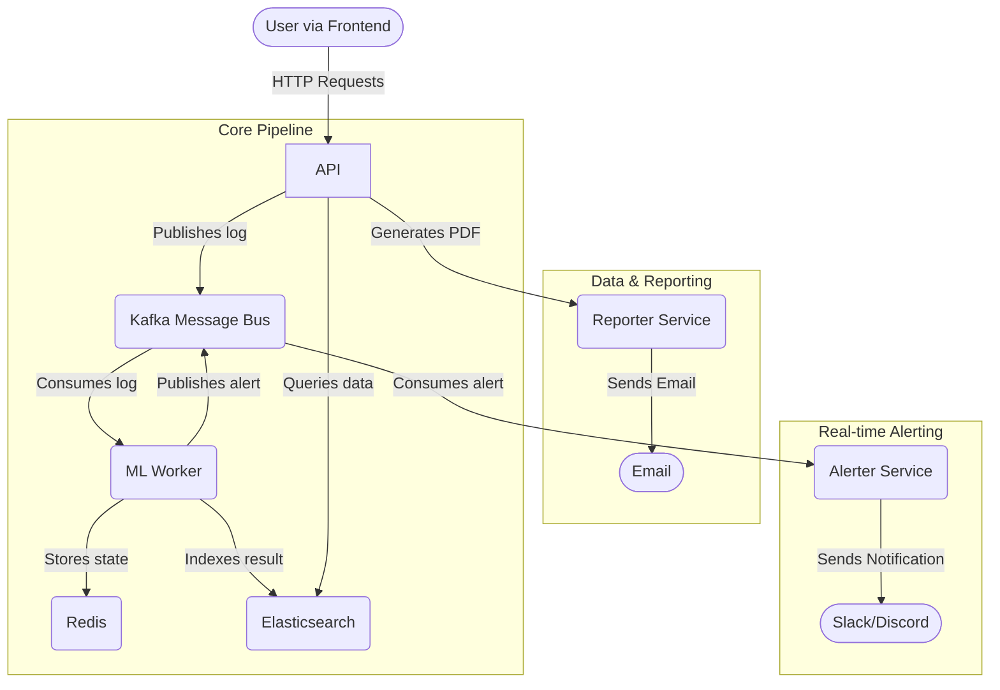

# Developer Documentation

This document provides a deeper technical overview of the AI/ML SOC Dashboard project, intended for developers who want to contribute or understand its inner workings.

## 1. System Architecture

The system is built on an event-driven, asynchronous architecture.

### 1.1. Core Concepts

-   **Decoupling**: The `API Server` and `ML Worker` are decoupled via `Kafka`. The API's only job is to accept a log, validate it, and publish it to a Kafka topic. It doesn't wait for the analysis to complete, making it fast and resilient.
-   **Asynchronous Processing**: The `ML Worker` consumes logs from Kafka at its own pace, performs analysis, and indexes the results. This allows the system to handle bursts of traffic without dropping logs.
-   **Dynamic Configuration**: The IP whitelist is managed centrally by the API but propagated to the `ML Worker` via a dedicated `config-updates` Kafka topic. This avoids the need for service restarts or shared databases for configuration.

### 1.2. Architecture Diagram



### 1.3. Data Flow

1.  **Log Submission**:
    `User/Client` -> `API (/logs)` -> `Kafka (logs topic)` -> `ML Worker` -> `Elasticsearch`

2.  **Data Display**:
    `Frontend` -> `API (/alerts)` -> `Elasticsearch` -> `Frontend`

3.  **Whitelist Update**:
    `Frontend` -> `API (/whitelist)` -> `Kafka (config-updates topic)` -> `ML Worker`

## 2. Service Deep Dive

### 2.1. API Server (`api/app.py`)

-   **Framework**: FastAPI.
-   **Responsibilities**:
    -   Provides HTTP endpoints for log submission (`/logs`), data retrieval (`/alerts`), and whitelist management (`/whitelist`).
    -   Manages an in-memory copy of the IP whitelist for quick validation and to serve the `/whitelist` GET endpoint.
    -   Publishes messages to two Kafka topics:
        -   `logs`: For new log messages to be analyzed.
        -   `config-updates`: For broadcasting changes to the IP whitelist.
    -   Queries Elasticsearch to serve data to the frontend.
-   **Key Dependencies**: `fastapi`, `aiokafka`, `elasticsearch`.

### 2.2. ML Worker (`ml_worker/model.py`)

-   **Framework**: `asyncio` with `aiokafka`.
-   **Responsibilities**:
    -   Consumes messages from both the `logs` and `config-updates` Kafka topics.
    -   Manages an in-memory IP whitelist, which is kept in sync via the `config-updates` topic.
    -   Performs log analysis using the `analyze_log` function.
    -   Enriches log data with analysis results (e.g., `is_anomaly`, `reason`, `source_ip`).
    -   Indexes the final, enriched document into Elasticsearch.
-   **Key Dependencies**: `aiokafka`, `elasticsearch`, `redis`.

## 3. Anomaly Detection Logic

The core analysis logic in the `analyze_log` function (`ml_worker/model.py`) follows a specific order of operations. The first rule to match determines the outcome.

1.  **IP Extraction**: It first attempts to extract an IP address from the log message using regex (`\b\d{1,3}\.\d{1,3}\.\d{1,3}\.\d{1,3}\b`).
2.  **Whitelist Check**: If an IP is found and exists in the `WHITELISTED_IPS` set, the log is immediately marked as a non-anomaly, and no further checks are performed.
3.  **Brute-Force Detection**:
    -   **Trigger**: The log message contains "failed login" keywords (e.g., `failed login`, `authentication failure`) and has an IP.
    -   **Mechanism**: It uses Redis to track the attempt. A key like `failed_logins:<ip_address>` is incremented. The key is set to expire after `BRUTE_FORCE_WINDOW_SECONDS` (default: 300s).
    -   **Threshold**: If the count reaches `BRUTE_FORCE_THRESHOLD` (default: 5), it's flagged as a "Brute-force attempt" anomaly. The Redis counter is then reset to prevent alert spam for the same attack.
4.  **Keyword-Based Detection**: If none of the above conditions are met, it performs a final check for general `ANOMALY_KEYWORDS` (e.g., "error", "exception", "unauthorized"). If a keyword is found, the log is flagged as an anomaly.

## 4. Data Models & Schemas

### 4.1. Kafka: `logs` Topic Message

A simple JSON object produced by the API for log ingestion.

```json
{
  "message": "failed login attempt for user admin from 192.168.1.105"
}
```

### 4.2. Kafka: `config-updates` Topic Message

A JSON object describing a change to the IP whitelist.

```json
{
  "action": "add",
  "ip": "8.8.8.8"
}
```

### 4.5. Elasticsearch: `processed_logs` Index Document

The final, enriched document stored in Elasticsearch after processing by the ML Worker.

```json
{
  "message": "failed login attempt for user admin from 192.168.1.105",
  "timestamp": 1678886400,
  "status": "new",
  "is_anomaly": true,
  "reason": "Brute-force attempt detected from 192.168.1.105 (5 attempts).",
  "source_ip": "192.168.1.105",
  "id": "auto-generated-es-id"
}
```

The `processed_logs` index has the following mapping for `source_ip`:

```json
{ "source_ip": {"type": "ip"}
}
```

## 5. API Documentation

The API server runs on port `8000`. Interactive documentation is available at `http://localhost:8000/docs`.

### `POST /logs`

Submits a new log message for analysis.

-   **Request Body**:
    ```json
    {
      "message": "your log message here"
    }
    ```
-   **Success Response (200 OK)**:
    ```json
    {
      "status": "Log submitted successfully"
    }
    ```

### `GET /alerts`

Retrieves processed logs from Elasticsearch.

-   **Query Parameters**:
    -   `is_anomaly` (bool, required): Set to `true` to get alerts, `false` to get successful logs.
-   **Success Response (200 OK)**:
    ```json
    [
      {
        "id": "some_es_document_id",
        "message": "failed login from 1.2.3.4",
        "is_anomaly": true,
        "timestamp": 1678886400,
        "status": "new",
        "reason": "Log contains anomalous keyword.",
        "source_ip": "1.2.3.4"
      }
    ]
    ```

### `PATCH /alerts/{alert_id}`

Updates the status of a specific alert.

-   **Path Parameters**:
    -   `alert_id` (string, required): The Elasticsearch document ID of the alert.
-   **Request Body**:
    ```json
    {
      "status": "resolved"
    }
    ```
-   **Success Response (200 OK)**:
    ```json
    {
      "status": "Alert status updated successfully"
    }
    ```

### `GET /whitelist`

Retrieves the current list of whitelisted IPs.

-   **Success Response (200 OK)**:
    ```json
    {
      "whitelisted_ips": ["192.168.1.1", "10.0.0.1"]
    }
    ```

### `POST /whitelist`

Adds a new IP address to the whitelist.

-   **Request Body**:
    ```json
    {
      "ip": "8.8.8.8"
    }
    ```
-   **Success Response (201 Created)**:
    ```json
    {
      "status": "IP added to whitelist"
    }
    ```

### `DELETE /whitelist/{ip}`

Removes an IP address from the whitelist.

-   **Path Parameters**:
    -   `ip` (string, required): The IP address to remove.
-   **Success Response (200 OK)**:
    ```json
    {
      "status": "IP removed from whitelist"
    }
    ```

## 6. Deployment & Operations

### 6.1. Deployment with Docker

The entire application is containerized and managed with Docker Compose.

1.  **Prerequisites**: Docker and Docker Compose.
2.  **Build and Run**: From the project root, run:
    ```bash
    docker-compose up --build
    ```
3.  **Access Points**:
    -   **SOC Dashboard**: `http://localhost:3000`
    -   **API Docs**: `http://localhost:8000/docs`
    -   **Kibana**: `http://localhost:5601` (for direct Elasticsearch exploration)

### 6.2. Future Deployment (Kubernetes, Cloud)

The microservice architecture is well-suited for deployment on platforms like Kubernetes. This would involve:
-   Creating Kubernetes Deployments and Services for each component.
-   Using a managed Kafka (e.g., Confluent Cloud, MSK), Elasticsearch (e.g., Elastic Cloud), and Redis (e.g., ElastiCache) service.
-   Configuring Ingress controllers to expose the API and Frontend.

### 6.3. Local Development & Debugging

-   **View Kafka Topics**: Use a tool like `kcat` (formerly `kafkacat`) to inspect messages in real-time.
    ```bash
    # Listen to the logs topic
    docker exec -it <kafka_container_id> kcat -b localhost:9093 -t logs

    # Listen to config updates
    docker exec -it <kafka_container_id> kcat -b localhost:9093 -t config-updates
    ```
-   **Query Elasticsearch Directly**: Use `curl` or Kibana's Dev Tools to inspect the indexed data.
    ```bash
    # Get all documents in the index
    curl -X GET "localhost:9200/processed_logs/_search?pretty"
    ```
-   **Check Redis Keys**: Use `redis-cli` to see the state of brute-force counters.
    ```bash
    # Connect to the Redis container
    docker exec -it <redis_container_name_or_id> redis-cli

    # Check keys for failed logins
    KEYS "failed_logins:*"

    # Get the count for a specific IP
    GET "failed_logins:192.168.1.105"
    ```

## 7. Configuration

These environment variables are used to configure the services. They are defined in `docker-compose.yml` and can be overridden by creating a `.env` file in the project root.

| Variable | Service(s) | `docker-compose.yml` Default | Description |
|---|---|---|---|
| `KAFKA_BROKER` | API, ML Worker | `kafka:9093` | Address of the Kafka broker (internal Docker network). |
| `ELASTICSEARCH_URL` | API, ML Worker | `http://elasticsearch:9200` | URL of the Elasticsearch instance. |
| `REDIS_URL` | ML Worker | `redis://redis:6379` | URL of the Redis instance. |
| `FRONTEND_ORIGIN` | API | `http://localhost:3000` | The origin URL for the frontend, used for CORS. |
| `ANOMALY_KEYWORDS` | ML Worker | `error,failed,denied,...` | Comma-separated list of keywords that flag a log as an anomaly. |
| `WHITELISTED_IPS` | API, ML Worker | `192.168.1.1,10.0.0.1` | Comma-separated list of initial IPs to whitelist. |
| `BRUTE_FORCE_THRESHOLD` | ML Worker | `5` | Number of failed logins to trigger a brute-force alert. |
| `BRUTE_FORCE_WINDOW_SECONDS` | ML Worker | `300` | Time window (in seconds) for tracking failed logins. |

## 8. Architectural Guide for New Features (MVP Roadmap)

This section outlines potential architectural approaches for implementing the features on the project roadmap.

### 8.1. Log & Event Collection (Integrations)

**Goal**: Easy, API-key-based integrations for services like Vercel, Supabase, Firebase, Postgres, etc.

-   **Architecture**: Create a new set of **"Collector" microservices**, one for each integration (e.g., `vercel-collector`, `supabase-collector`). This keeps integration-specific logic isolated.
-   **Function**: Each collector's sole responsibility is to connect to its source (via API polling, webhook listeners, or direct database connection), fetch new logs, transform them into the standard `{"message": "..."}` JSON format, and publish them to the `logs` Kafka topic.
-   **Data Flow**: `Vercel` -> `Vercel Collector` -> `Kafka ('logs' topic)` -> `ML Worker`.
-   **Benefit**: The core `API Server` and `ML Worker` remain unchanged. Adding a new integration is as simple as creating a new collector service. Configuration (API keys, DB strings) is managed via environment variables for each collector.

### 8.2. Advanced AI-Powered Threat Detection

#### Unusual API Usage (Spikes & Abuse)

-   **Architecture**: This logic should be enhanced within the existing **`ML Worker`**. The `detect_traffic_spike` function is a starting point.
-   **Mechanism**:
    1.  **Stateful Analysis**: Use Redis to maintain more granular counters (e.g., per-IP request rates, per-endpoint usage).
    2.  **Baseline Calculation**: Implement a mechanism to calculate a moving average and standard deviation for these metrics over a longer period (e.g., the last 24 hours). This baseline represents "normal" behavior.
    3.  **Thresholding**: An alert is triggered if a new data point (e.g., the current minute's request count for an IP) exceeds a dynamic threshold, such as `average + 3 * standard_deviation`.

#### Credential Leak Scanning

-   **Architecture**: This requires a new, specialized, scheduled microservice: **`credential-scanner-worker`**.
-   **Mechanism**:
    1.  **Scheduled Execution**: This service does not consume from Kafka. Instead, it runs on a schedule (e.g., using a cron job within the container or a Kubernetes CronJob) every few hours.
    2.  **External API Integration**: It uses APIs from services like GitHub to scan public repositories for code patterns matching your organization's domain or known code signatures.
    3.  **Pattern Matching**: It uses advanced regex and entropy analysis to identify potential secrets (e.g., `sk_live_...`, high-entropy strings).
    4.  **Alerting**: If a potential leak is found, it constructs a detailed alert message and publishes it to a new, dedicated Kafka topic like `high-priority-alerts`.

### 8.3. Real-Time Alerts (Slack/Discord/Email)

-   **Architecture**: Create a new **`Alerter` microservice**.
-   **Mechanism**:
    1.  **New Kafka Topic**: The `ML Worker` (and `credential-scanner-worker`) will publish high-confidence anomalies (like brute-force, credential leaks) to the `high-priority-alerts` topic.
    2.  **Dedicated Consumer**: The `Alerter` service will be the sole consumer of this topic.
    3.  **Message Formatting**: It will take the structured JSON alert and format it into a "plain English" message. Example: "🚨 **Security Alert: Brute-force attack detected!** We've blocked 5 failed login attempts from IP address `198.51.100.10`."
    4.  **Dispatching**: Based on its environment variables (e.g., `SLACK_WEBHOOK_URL`, `DISCORD_WEBHOOK_URL`), it will send the formatted message to the configured channels.
    -   **Benefit**: This completely decouples detection from notification. You can add email, SMS, or PagerDuty support by only modifying the `Alerter` service.

### 8.4. Dashboard Enhancements

#### PDF Report Export

-   **Architecture**: This functionality can be added as a new endpoint to the existing **`API Server`**.
-   **Endpoint**: `GET /reports/monthly.pdf?month=YYYY-MM`
-   **Mechanism**:
    1.  **Data Aggregation**: The endpoint would run several aggregation queries on Elasticsearch to gather summary statistics for the given month (e.g., total incidents, incidents by type, top targeted IPs).
    2.  **PDF Generation**: It would use a library like `ReportLab` (for complex layouts) or `WeasyPrint` (for HTML/CSS to PDF) to generate a professional-looking report with charts and tables from the aggregated data.
    3.  **Streaming Response**: The generated PDF would be streamed back to the user as a `StreamingResponse` in FastAPI to avoid high memory usage and blocking the server.